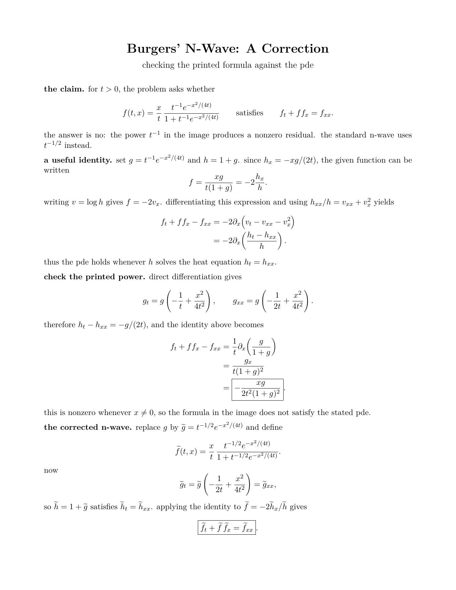

# chris / riye-prog

i'm a 16 y/o developer who builds software that excites me: algorithms, interfaces, game systems, servers, and databases.

**7 years in swe** · **about 2 years networking my own servers and managing databases**

## what i've worked on

- **[seedy](https://github.com/riye-prog/seedy):** minecraft seed recovery and world generation tools. it uses observed structures to narrow seed possibilities, then brings biome maps, structure locations, and loot predictions into an in-game interface.
- **infrastructure:** networking and maintaining my own servers, plus database work.
- **mathematics:** i enjoy studying mathematics in my free time lots lol.

## languages and tools

**languages and web technologies:** java · c · c++ · c# · rust · javascript · typescript · ruby · html · css · python

**also open to:** go · php · kotlin

**technical writing:** latex

## academics and math

**1520 psat** · **1510 practice sat**

i've worked through mit integration bee problems and enjoy topology as well as integration. here's an example of one of my most recent proofs (technically a disproof):

### burgers' n-wave

the attached problem asks whether an n-wave with a $t^{-1}e^{-x^2/(4t)}$ factor satisfies $f_t+ff_x=f_{xx}$. that printed factor gives a nonzero residual:

$$
f_t+ff_x-f_{xx}=-\frac{xg}{2t^2(1+g)^2},
\qquad g=t^{-1}e^{-x^2/(4t)}.
$$

the one-page derivation below shows the calculation and verifies the corrected $t^{-1/2}$ version.

[open the pdf](assets/burgers-n-wave.pdf) · [read the latex source](assets/burgers-n-wave.tex)
