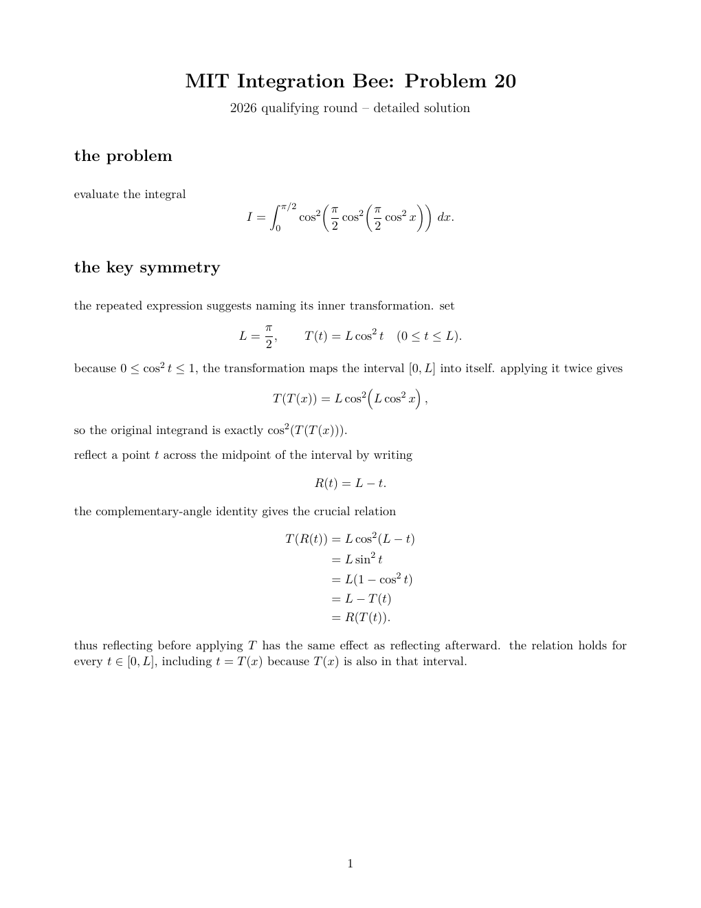
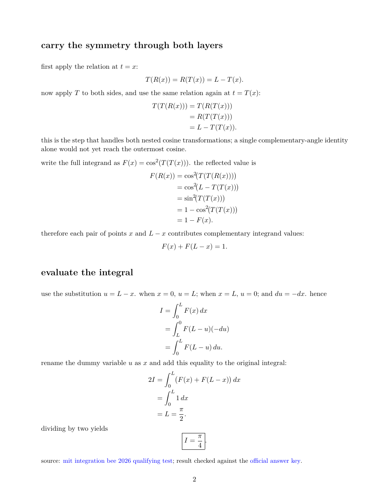

# chris / riye-prog

i'm a 16-year-old developer who likes building software that has to work beyond the demo: algorithms, interfaces, game systems, servers, and databases.

**7 years building software** · **about 2 years networking my own servers and managing databases**

## what i've worked on

- **[seedy](https://github.com/riye-prog/seedy):** minecraft seed recovery and world generation tools. it uses observed structures to narrow seed possibilities, then brings biome maps, structure locations, and loot predictions into an in-game interface.
- **infrastructure:** networking and maintaining my own servers, plus database work.
- **mathematical problem solving:** i enjoy problems where finding the right structure matters more than brute force.

## languages and tools

**languages and web technologies:** java · c · c++ · c# · rust · javascript · typescript · ruby · html · css · python

**also open to:** go · php · kotlin

**technical writing:** latex

## academics and math

**1520 psat** · **1510 practice sat**

i've also worked through mit integration bee problems. for a concrete example, i wrote out every step of problem 20 from the 2026 qualifying round, using a reflection symmetry to evaluate a nested cosine integral.

**[read the complete two-page latex solution (pdf)](assets/mit-integrals.pdf)** · [original problem](https://math.mit.edu/~yyao1/pdf/qualifying_round_2026_test.pdf)

## get in touch

[see my work on github](https://github.com/riye-prog) · [talk through a project on discord](https://discord.gg/qTuW9yw6db)
