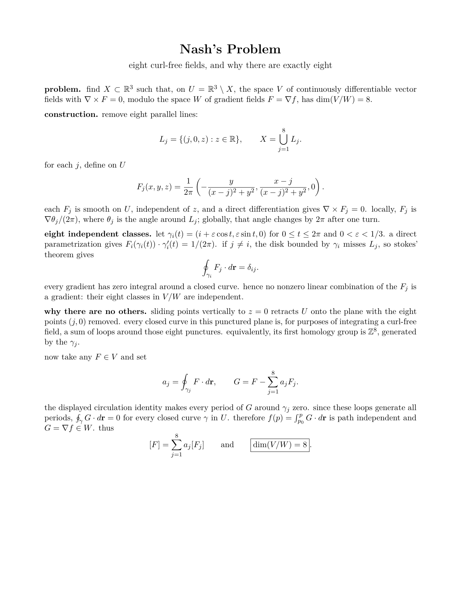

# chris / riye-prog

i'm a 16 y/o developer who builds software that has to work beyond the demo: algorithms, interfaces, game systems, servers, and databases.

**7 years in swe** · **about 2 years networking my own servers and managing databases**

## what i've worked on

- **[seedy](https://github.com/riye-prog/seedy):** minecraft seed recovery and world generation tools. it uses observed structures to narrow seed possibilities, then brings biome maps, structure locations, and loot predictions into an in-game interface.
- **infrastructure:** networking and maintaining my own servers, plus database work.
- **mathematical problem solving:** i enjoy problems where finding the right structure matters more than brute force.

## languages and tools

**languages and web technologies:** java · c · c++ · c# · rust · javascript · typescript · ruby · html · css · python

**also open to:** go · php · kotlin

**technical writing:** latex

## academics and math

**1520 psat** · **1510 practice sat**

i've worked through mit integration bee problems and enjoy topology as well as integration. here's a one-page solution to nash's problem:

> find a subset $X\subset\mathbb R^3$ such that the curl-free vector fields on $\mathbb R^3\setminus X$, modulo gradient fields, form an eight-dimensional space.

the construction removes eight parallel lines. each line gives a curl-free angular field with circulation around that line, and the eight circulation values distinguish all fields modulo gradients. the page below shows the fields and proves both independence and completeness.

[open the pdf](assets/nash-problem.pdf) · [read the latex source](assets/nash-problem.tex)
